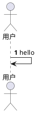

## 变更记录

| 序号 | 变更项   | 版本 | 作者   | 日期       |
| ---- | -------- | ---- | ------ | ---------- |
| 1    | 完成文档 | V1.0 | rellik | 2023-08-10 |
|      |          |      |        |            |

## 项目背景

XXX能力建设，解决一下问题：
- 需求1
- 需求2

### 相关资料

链接

### 参与人

| 项目负责人 | 产品经理 | 设计师 | 工程师 |
| ---------- | -------- | ------ | ------ |
|            |          |        |        |

### 需求清单


### 业务架构


## 功能设计

### 结构设计

#### 用例图
> 外部md，通过mindmap转用例图

#### 组件图
```plantuml
@startuml

@enduml
```

#### 流程图


#### 领域模型


#### 状态图


#### 时序图



### 存储设计

#### ER图


#### 表结构

```sql
CREATE TABLE IF NOT EXISTS `user_t` {
    `id`   BIGINT   NOT NULL AUTO_INCREMENT COMMENT 'ID'
}
```

### API设计

#### 接口A

##### 接口协议
`GET /import/dataset?id=1`

##### 请求参数

| 参数 | 类型    | 描述 |
| ---- | ------- | ---- |
| id   | integer | id     |

##### 请求体

##### 响应格式

```json
{
    "data": {
        "success": true
    }
}
```

### SPI设计


## 非功能设计


## 资源安排

### 人力资源

### 时间资源
