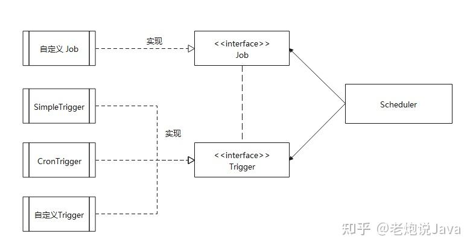
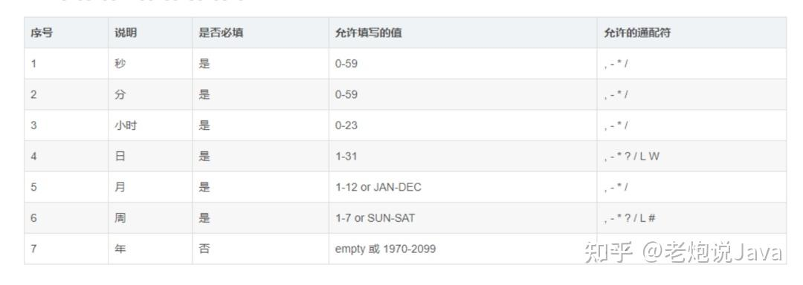

## 前言

Quartz是OpenSymphony开源组织在Job scheduling领域又一个开源项目，完全由Java开发，可以用来执行定时任务，类似于java.util.Timer。但是相较于Timer， Quartz增加了很多功能：

- 持久性作业 - 就是保持调度定时的状态;
- 作业管理 - 对调度作业进行有效的管理;
- <http://www.quartz-scheduler.org/documentation/>
- <http://www.quartz-scheduler.org/api/2.3.0/index.html>

## 基础使用

Quartz 的核心类有以下三部分：

- 任务 Job ： 需要实现的任务类，实现 execute() 方法，执行后完成任务。
- 触发器 Trigger ： 包括 SimpleTrigger 和 CronTrigger。
- 调度器 Scheduler ： 任务调度器，负责基于 Trigger触发器，来执行Job任务。



## Demo

按照官网的 Demo，搭建一个纯 maven 项目，添加依赖：

```xml
<!-- 核心包 -->
<dependency>
    <groupId>org.quartz-scheduler</groupId>
    <artifactId>quartz</artifactId>
    <version>2.3.0</version>
</dependency>
<!-- 工具包 -->
<dependency>
    <groupId>org.quartz-scheduler</groupId>
    <artifactId>quartz-jobs</artifactId>
    <version>2.3.0</version>
</dependency>
```

新建一个任务，实现了 org.quartz.Job 接口：

```java
public class MyJob implements Job {
    @Override
    public void execute(JobExecutionContext context) throws JobExecutionException {
        System.out.println("任务被执行了。。。");
    }
}
```

main 方法，创建调度器、jobDetail 实例、trigger 实例、执行：

```java
public static void main(String[] args) throws Exception {
    // 1.创建调度器 Scheduler
    SchedulerFactory factory = new StdSchedulerFactory();
    Scheduler scheduler = factory.getScheduler();

    // 2.创建JobDetail实例，并与MyJob类绑定(Job执行内容)
    JobDetail job = JobBuilder.newJob(MyJob.class)
        .withIdentity("job1", "group1")
        .build();

    // 3.构建Trigger实例,每隔30s执行一次
    Trigger trigger = TriggerBuilder.newTrigger()
        .withIdentity("trigger1", "group1")
        .startNow()
        .withSchedule(
            simpleSchedule()
            .withIntervalInSeconds(30)
            .repeatForever()
        ).build();

    // 4.执行，开启调度器
    scheduler.scheduleJob(job, trigger);
    System.out.println(System.currentTimeMillis());
    scheduler.start();

    //主线程睡眠1分钟，然后关闭调度器
    TimeUnit.MINUTES.sleep(1);
    scheduler.shutdown();
    System.out.println(System.currentTimeMillis());
}
```


## JobDetail

JobDetail 的作用是绑定 Job，是一个任务实例，它为 Job 添加了许多扩展参数。

每次Scheduler调度执行一个Job的时候，首先会拿到对应的Job，然后创建该Job实例，再去执行Job中的execute()的内容，任务执行结束后，关联的Job对象实例会被释放，且会被JVM GC清除。

为什么设计成JobDetail + Job，不直接使用Job？

JobDetail 定义的是任务数据，而真正的执行逻辑是在Job中。

这是因为任务是有可能并发执行，如果Scheduler直接使用Job，就会存在对同一个Job实例并发访问的问题。

而JobDetail & Job 方式，Sheduler每次执行，都会根据JobDetail创建一个新的Job实例，这样就可以 规避并发访问 的问题。

## JobExecutionContext

当 Scheduler 调用一个 job，就会将 JobExecutionContext 传递给 Job 的 execute() 方法;

Job 能通过 JobExecutionContext 对象访问到 Quartz 运行时候的环境以及 Job 本身的明细数据。

任务实现的 execute() 方法，可以通过 context 参数获取。

```java
public interface Job {
    void execute(JobExecutionContext context)
        throws JobExecutionException;
}
```

在 Builder 建造过程中，可以使用如下方法：

```java
usingJobData("tiggerDataMap", "测试传参")
```

在 execute 方法中获取：

```java
context.getTrigger().getJobDataMap().get("tiggerDataMap");
context.getJobDetail().getJobDataMap().get("tiggerDataMap");
```

## Job 状态参数

有状态的 job 可以理解为多次 job调用期间可以持有一些状态信息，这些状态信息存储在 JobDataMap 中。

而默认的无状态 job，每次调用时都会创建一个新的 JobDataMap。

```java
//多次调用 Job 的时候，将参数保留在 JobDataMap
@PersistJobDataAfterExecution
public class JobStatus implements Job {
    @Override
    public void execute(JobExecutionContext context) throws JobExecutionException {
        long count = (long) context.getJobDetail().getJobDataMap().get("count");
        System.out.println("当前执行，第" + count + "次");
        context.getJobDetail().getJobDataMap().put("count", ++count);
    }
}

JobDetail job = JobBuilder.newJob(JobStatus.class)
                .withIdentity("statusJob", "group1")
                .usingJobData("count", 1L)
                .build();
```

输出结果：

```plaintext
当前执行，第1次
[main] INFO org.quartz.core.QuartzScheduler - Scheduler DefaultQuartzScheduler_$_NON_CLUSTERED started.
当前执行，第2次
当前执行，第3次
```

## Trigger

### 定时启动/关闭

Trigger 可以设置任务的开始结束时间， Scheduler 会根据参数进行触发。

```java
Calendar instance = Calendar.getInstance();
Date startTime = instance.getTime();
instance.add(Calendar.MINUTE, 1);
Date endTime = instance.getTime();

// 3.构建Trigger实例
Trigger trigger = TriggerBuilder.newTrigger()
    .withIdentity("trigger1", "group1")
    // 开始时间
    .startAt(startTime)
    // 结束时间
    .endAt(endTime)
    .build();
```

在 job 中也能拿到对应的时间，并进行业务判断

```java
public void execute(JobExecutionContext context) throws JobExecutionException {
    System.out.println("任务执行。。。");
    System.out.println(context.getTrigger().getStartTime());
    System.out.println(context.getTrigger().getEndTime());
}
```

运行结果：

```text
[main] INFO org.quartz.impl.StdSchedulerFactory - Quartz scheduler version: 2.3.0
1633149326723
任务执行。。。
Sat Oct 02 12:35:26 CST 2021
Sat Oct 02 12:36:26 CST 2021
[main] INFO org.quartz.core.QuartzScheduler - Scheduler DefaultQuartzScheduler_$_NON_CLUSTERED started.
```

### SimpleTrigger

这是比较简单的一类触发器，用它能实现很多基础的应用。使用它的主要场景包括：

- 在指定时间段内，执行一次任务: 最基础的 Trigger 不设置循环，设置开始时间。

- 在指定时间段内，循环执行任务: 在 1 基础上加上循环间隔。可以指定 永远循环、运行指定次数

```java
TriggerBuilder.newTrigger()
    .withSchedule(SimpleScheduleBuilder
                  .simpleSchedule()
                  .withIntervalInSeconds(30)
                  .repeatForever())
```

withRepeatCount(count) 是重复次数，实际运行次数为 count+1

```java
TriggerBuilder.newTrigger()
    .withSchedule(SimpleScheduleBuilder
                  .simpleSchedule()
                  .withIntervalInSeconds(30)
                  .withRepeatCount(5))
```

### 立即开始，指定时间结束

这个，略。

### CronTrigger

CronTrigger 是基于日历的任务调度器，在实际应用中更加常用。

使用方式就是绑定调度器时换一下：

```java
TriggerBuilder.newTrigger().withSchedule(CronScheduleBuilder.cronSchedule("**** * ?"))
```

Cron 表达式这里不介绍，贴个图跳过



## SpringBoot 整合

- cron表达式定时执行
- 并发执行
- 错误策略
- 启动执行、暂停执行
- 设置启动时间、停止时间

Quartz 自带有数据库模式，脚本都是现成的：

<https://gitee.com/qianwei4712/code-of-shiva/blob/master/quartz/quartz.sql>

保存任务的数据库表：

```sql
CREATE TABLE `quartz_job` (
  `job_id` bigint(20) NOT NULL AUTO_INCREMENT COMMENT '任务ID',
  `job_name` varchar(64) NOT NULL DEFAULT '' COMMENT '任务名称',
  `job_group` varchar(64) NOT NULL DEFAULT 'DEFAULT' COMMENT '任务组名',
  `invoke_target` varchar(500) NOT NULL COMMENT '调用目标字符串',
  `cron_expression` varchar(255) DEFAULT '' COMMENT 'cron执行表达式',
  `misfire_policy` varchar(20) DEFAULT '3' COMMENT '计划执行错误策略（1立即执行 2执行一次 3放弃执行）',
  `concurrent` char(1) DEFAULT '1' COMMENT '是否并发执行（0允许 1禁止）',
  `status` char(1) DEFAULT '0' COMMENT '状态（0正常 1暂停）',
  `remark` varchar(500) DEFAULT '' COMMENT '备注信息',
  PRIMARY KEY (`job_id`,`job_name`,`job_group`)
) ENGINE=InnoDB AUTO_INCREMENT=2 DEFAULT CHARSET=utf8 COMMENT='定时任务调度表';
```

最后准备一个任务方法：

```java
@Slf4j
@Component("mysqlJob")
public class MysqlJob {
    protected final Logger logger = LoggerFactory.getLogger(this.getClass());
    public void execute(String param) {
        logger.info("执行 Mysql Job，当前时间：{}，任务参数：{}", LocalDateTime.now().format(DateTimeFormatter.ofPattern("yyyy-MM-dd HH:mm:ss")), param);
    }
}
```

### 核心代码

ScheduleConfig 配置代码类：

```java
@Configuration
public class ScheduleConfig {

    @Bean
    public SchedulerFactoryBean schedulerFactoryBean(DataSource dataSource) {
        SchedulerFactoryBean factory = new SchedulerFactoryBean();
        factory.setDataSource(dataSource);

        // quartz参数
        Properties prop = new Properties();
        prop.put("org.quartz.scheduler.instanceName", "shivaScheduler");
        prop.put("org.quartz.scheduler.instanceId", "AUTO");
        // 线程池配置
        prop.put("org.quartz.threadPool.class", "org.quartz.simpl.SimpleThreadPool");
        prop.put("org.quartz.threadPool.threadCount", "20");
        prop.put("org.quartz.threadPool.threadPriority", "5");
        // JobStore配置
        prop.put("org.quartz.jobStore.class", "org.quartz.impl.jdbcjobstore.JobStoreTX");
        // 集群配置
        prop.put("org.quartz.jobStore.isClustered", "true");
        prop.put("org.quartz.jobStore.clusterCheckinInterval", "15000");
        prop.put("org.quartz.jobStore.maxMisfiresToHandleAtATime", "1");
        prop.put("org.quartz.jobStore.txIsolationLevelSerializable", "true");

        // sqlserver 启用
        // prop.put("org.quartz.jobStore.selectWithLockSQL", "SELECT * FROM {0}LOCKS UPDLOCK WHERE LOCK_NAME = ?");
        prop.put("org.quartz.jobStore.misfireThreshold", "12000");
        prop.put("org.quartz.jobStore.tablePrefix", "QRTZ_");
        factory.setQuartzProperties(prop);

        factory.setSchedulerName("shivaScheduler");
        // 延时启动
        factory.setStartupDelay(1);
        factory.setApplicationContextSchedulerContextKey("applicationContextKey");
        // 可选，QuartzScheduler
        // 启动时更新己存在的Job，这样就不用每次修改targetObject后删除qrtz_job_details表对应记录了
        factory.setOverwriteExistingJobs(true);
        // 设置自动启动，默认为true
        factory.setAutoStartup(true);

        return factory;
    }
}
```

ScheduleUtils 调度工具类，这是本篇中最核心的代码：

```java
public class ScheduleUtils {
    /**
     * 得到quartz任务类
     *
     * @param job 执行计划
     * @return 具体执行任务类
     */
    private static Class<? extends Job> getQuartzJobClass(QuartzJob job) {
        boolean isConcurrent = "0".equals(job.getConcurrent());
        return isConcurrent ? QuartzJobExecution.class : QuartzDisallowConcurrentExecution.class;
    }

    /**
     * 构建任务触发对象
     */
    public static TriggerKey getTriggerKey(Long jobId, String jobGroup) {
        return TriggerKey.triggerKey(ScheduleConstants.TASK_CLASS_NAME + jobId, jobGroup);
    }

    /**
     * 构建任务键对象
     */
    public static JobKey getJobKey(Long jobId, String jobGroup) {
        return JobKey.jobKey(ScheduleConstants.TASK_CLASS_NAME + jobId, jobGroup);
    }

    /**
     * 创建定时任务
     */
    public static void createScheduleJob(Scheduler scheduler, QuartzJob job) throws Exception {
        Class<? extends Job> jobClass = getQuartzJobClass(job);
        // 构建job信息
        Long jobId = job.getJobId();
        String jobGroup = job.getJobGroup();
        JobDetail jobDetail = JobBuilder.newJob(jobClass).withIdentity(getJobKey(jobId, jobGroup)).build();

        // 表达式调度构建器
        CronScheduleBuilder cronScheduleBuilder = CronScheduleBuilder.cronSchedule(job.getCronExpression());
        cronScheduleBuilder = handleCronScheduleMisfirePolicy(job, cronScheduleBuilder);

        // 按新的cronExpression表达式构建一个新的trigger
        CronTrigger trigger = TriggerBuilder.newTrigger().withIdentity(getTriggerKey(jobId, jobGroup))
                .withSchedule(cronScheduleBuilder).build();

        // 放入参数，运行时的方法可以获取
        jobDetail.getJobDataMap().put(ScheduleConstants.TASK_PROPERTIES, job);

        // 判断是否存在
        if (scheduler.checkExists(getJobKey(jobId, jobGroup))) {
            // 防止创建时存在数据问题 先移除，然后在执行创建操作
            scheduler.deleteJob(getJobKey(jobId, jobGroup));
        }

        scheduler.scheduleJob(jobDetail, trigger);

        // 暂停任务
        if (job.getStatus().equals(ScheduleConstants.Status.PAUSE.getValue())) {
            scheduler.pauseJob(ScheduleUtils.getJobKey(jobId, jobGroup));
        }
    }

    /**
     * 设置定时任务策略
     */
    public static CronScheduleBuilder handleCronScheduleMisfirePolicy(QuartzJob job, CronScheduleBuilder cb)
            throws Exception {
        switch (job.getMisfirePolicy()) {
            case ScheduleConstants.MISFIRE_DEFAULT:
                return cb;
            case ScheduleConstants.MISFIRE_IGNORE_MISFIRES:
                return cb.withMisfireHandlingInstructionIgnoreMisfires();
            case ScheduleConstants.MISFIRE_FIRE_AND_PROCEED:
                return cb.withMisfireHandlingInstructionFireAndProceed();
            case ScheduleConstants.MISFIRE_DO_NOTHING:
                return cb.withMisfireHandlingInstructionDoNothing();
            default:
                throw new Exception("The task misfire policy '" + job.getMisfirePolicy()
                        + "' cannot be used in cron schedule tasks");
        }
    }
}
```

这里可以看到，在完成任务与触发器的关联后，如果是暂停状态，会先让调度器停止任务。

AbstractQuartzJob 抽象任务：

```java
public abstract class AbstractQuartzJob implements Job {
    private static final Logger log = LoggerFactory.getLogger(AbstractQuartzJob.class);

    /**
     * 线程本地变量
     */
    private static ThreadLocal<Date> threadLocal = new ThreadLocal<>();

    @Override
    public void execute(JobExecutionContext context) throws JobExecutionException {
        QuartzJob job = new QuartzJob();
        BeanUtils.copyBeanProp(job, context.getMergedJobDataMap().get(ScheduleConstants.TASK_PROPERTIES));
        try {
            before(context, job);
            if (job != null) {
                doExecute(context, job);
            }
            after(context, job, null);
        } catch (Exception e) {
            log.error("任务执行异常  - ：", e);
            after(context, job, e);
        }
    }

    /**
     * 执行前
     *
     * @param context 工作执行上下文对象
     * @param job     系统计划任务
     */
    protected void before(JobExecutionContext context, QuartzJob job) {
        threadLocal.set(new Date());
    }

    /**
     * 执行后
     *
     * @param context 工作执行上下文对象
     * @param sysJob  系统计划任务
     */
    protected void after(JobExecutionContext context, QuartzJob sysJob, Exception e) {

    }

    /**
     * 执行方法，由子类重载
     *
     * @param context 工作执行上下文对象
     * @param job     系统计划任务
     * @throws Exception 执行过程中的异常
     */
    protected abstract void doExecute(JobExecutionContext context, QuartzJob job) throws Exception;
}
```

这个类将原本 execute 方法执行的任务，下放到了子类重载的 doExecute 方法中
同时准备实现，分了允许并发和不允许并发，差别就是一个注解：

```java
public class QuartzJobExecution extends AbstractQuartzJob {
    @Override
    protected void doExecute(JobExecutionContext context, QuartzJob job) throws Exception {
        JobInvokeUtil.invokeMethod(job);
    }
}

@DisallowConcurrentExecution
public class QuartzDisallowConcurrentExecution extends AbstractQuartzJob {
    @Override
    protected void doExecute(JobExecutionContext context, QuartzJob job) throws Exception {
        JobInvokeUtil.invokeMethod(job);
    }
}
```

最后由 JobInvokeUtil 通过反射，进行实际的方法调用：

```java
public class JobInvokeUtil {
    /**
     * 执行方法
     *
     * @param job 系统任务
     */
    public static void invokeMethod(QuartzJob job) throws Exception {
        String invokeTarget = job.getInvokeTarget();
        String beanName = getBeanName(invokeTarget);
        String methodName = getMethodName(invokeTarget);
        List<Object[]> methodParams = getMethodParams(invokeTarget);

        if (!isValidClassName(beanName)) {
            Object bean = SpringUtils.getBean(beanName);
            invokeMethod(bean, methodName, methodParams);
        } else {
            Object bean = Class.forName(beanName).newInstance();
            invokeMethod(bean, methodName, methodParams);
        }
    }

    /**
     * 调用任务方法
     *
     * @param bean         目标对象
     * @param methodName   方法名称
     * @param methodParams 方法参数
     */
    private static void invokeMethod(Object bean, String methodName, List<Object[]> methodParams)
            throws NoSuchMethodException, SecurityException, IllegalAccessException, IllegalArgumentException,
            InvocationTargetException {
        if (StringUtils.isNotNull(methodParams) && methodParams.size() > 0) {
            Method method = bean.getClass().getDeclaredMethod(methodName, getMethodParamsType(methodParams));
            method.invoke(bean, getMethodParamsValue(methodParams));
        } else {
            Method method = bean.getClass().getDeclaredMethod(methodName);
            method.invoke(bean);
        }
    }

    /**
     * 校验是否为为class包名
     *
     * @param invokeTarget 名称
     * @return true是 false否
     */
    public static boolean isValidClassName(String invokeTarget) {
        return StringUtils.countMatches(invokeTarget, ".") > 1;
    }

    /**
     * 获取bean名称
     *
     * @param invokeTarget 目标字符串
     * @return bean名称
     */
    public static String getBeanName(String invokeTarget) {
        String beanName = StringUtils.substringBefore(invokeTarget, "(");
        return StringUtils.substringBeforeLast(beanName, ".");
    }

    /**
     * 获取bean方法
     *
     * @param invokeTarget 目标字符串
     * @return method方法
     */
    public static String getMethodName(String invokeTarget) {
        String methodName = StringUtils.substringBefore(invokeTarget, "(");
        return StringUtils.substringAfterLast(methodName, ".");
    }

    /**
     * 获取method方法参数相关列表
     *
     * @param invokeTarget 目标字符串
     * @return method方法相关参数列表
     */
    public static List<Object[]> getMethodParams(String invokeTarget) {
        String methodStr = StringUtils.substringBetween(invokeTarget, "(", ")");
        if (StringUtils.isEmpty(methodStr)) {
            return null;
        }
        String[] methodParams = methodStr.split(",");
        List<Object[]> classs = new LinkedList<>();
        for (int i = 0; i < methodParams.length; i++) {
            String str = StringUtils.trimToEmpty(methodParams[i]);
            // String字符串类型，包含'
            if (StringUtils.contains(str, "'")) {
                classs.add(new Object[]{StringUtils.replace(str, "'", ""), String.class});
            }
            // boolean布尔类型，等于true或者false
            else if (StringUtils.equals(str, "true") || StringUtils.equalsIgnoreCase(str, "false")) {
                classs.add(new Object[]{Boolean.valueOf(str), Boolean.class});
            }
            // long长整形，包含L
            else if (StringUtils.containsIgnoreCase(str, "L")) {
                classs.add(new Object[]{Long.valueOf(StringUtils.replaceIgnoreCase(str, "L", "")), Long.class});
            }
            // double浮点类型，包含D
            else if (StringUtils.containsIgnoreCase(str, "D")) {
                classs.add(new Object[]{Double.valueOf(StringUtils.replaceIgnoreCase(str, "D", "")), Double.class});
            }
            // 其他类型归类为整形
            else {
                classs.add(new Object[]{Integer.valueOf(str), Integer.class});
            }
        }
        return classs;
    }

    /**
     * 获取参数类型
     *
     * @param methodParams 参数相关列表
     * @return 参数类型列表
     */
    public static Class<?>[] getMethodParamsType(List<Object[]> methodParams) {
        Class<?>[] classs = new Class<?>[methodParams.size()];
        int index = 0;
        for (Object[] os : methodParams) {
            classs[index] = (Class<?>) os[1];
            index++;
        }
        return classs;
    }

    /**
     * 获取参数值
     *
     * @param methodParams 参数相关列表
     * @return 参数值列表
     */
    public static Object[] getMethodParamsValue(List<Object[]> methodParams) {
        Object[] classs = new Object[methodParams.size()];
        int index = 0;
        for (Object[] os : methodParams) {
            classs[index] = (Object) os[0];
            index++;
        }
        return classs;
    }
}
```

启动程序后可以看到，调度器已经启动：

```text
2021-10-06 16:26:05.162  INFO 10764 --- [shivaScheduler]] o.s.s.quartz.SchedulerFactoryBean        : Starting Quartz Scheduler now, after delay of 1 seconds
2021-10-06 16:26:05.306  INFO 10764 --- [shivaScheduler]] org.quartz.core.QuartzScheduler          : Scheduler shivaScheduler_$_DESKTOP-OKMJ1351633508761366 started.
```

### 新增调度任务

添加任务，使用如下 json 进行请求：

```json
{
  "concurrent": "1",
  "cronExpression": "0/10 **** ?",
  "invokeTarget": "mysqlJob.execute('got it!!!')",
  "jobGroup": "mysqlGroup",
  "jobId": 9,
  "jobName": "新增 mysqlJob 任务",
  "misfirePolicy": "1",
  "remark": "",
  "status": "0"
}
```

```java
@Override
@Transactional(rollbackFor = Exception.class)
public int insertJob(QuartzJob job) throws Exception {
    // 先将任务设置为暂停状态
    job.setStatus(ScheduleConstants.Status.PAUSE.getValue());
    int rows = quartzMapper.insert(job);
    if (rows > 0) {
        ScheduleUtils.createScheduleJob(scheduler, job);
    }
    return rows;
}
```

先将任务设置为暂停状态，数据库插入成功后，在调度器创建任务。

再手动启动任务，根据 ID 来启动任务：

```java
@Override
    public int changeStatus(Long jobId, String status) throws SchedulerException {
        int rows = quartzMapper.changeStatus(jobId, status);
        if (rows == 0) {
            return rows;
        }
        //更新成功，需要改调度器内任务的状态
        //拿到整个任务
        QuartzJob job = quartzMapper.selectJobById(jobId);
        //根据状态来启动或者关闭
        if (ScheduleConstants.Status.NORMAL.getValue().equals(status)) {
            rows = resumeJob(job);
        } else if (ScheduleConstants.Status.PAUSE.getValue().equals(status)) {
            rows = pauseJob(job);
        }
        return rows;
    }

@Override
public int resumeJob(QuartzJob job) throws SchedulerException {
    Long jobId = job.getJobId();
    String jobGroup = job.getJobGroup();
    job.setStatus(ScheduleConstants.Status.NORMAL.getValue());
    int rows = quartzMapper.updateById(job);
    if (rows > 0) {
        scheduler.resumeJob(ScheduleUtils.getJobKey(jobId, jobGroup));
    }
    return rows;
}
```

暂停任务的代码也相同。

调用启动后可以看到控制台打印日志：

```text
2021-10-06 20:36:30.018  INFO 8536 --- [eduler_Worker-3] cn.shiva.quartz.job.MysqlJob             : 执行 Mysql Job，当前时间：2021-10-06 20:36:30，任务参数：got it!!!
2021-10-06 20:36:40.016  INFO 8536 --- [eduler_Worker-4] cn.shiva.quartz.job.MysqlJob             : 执行 Mysql Job，当前时间：2021-10-06 20:36:40，任务参数：got it!!!
2021-10-06 20:36:50.017  INFO 8536 --- [eduler_Worker-5] cn.shiva.quartz.job.MysqlJob             : 执行 Mysql Job，当前时间：2021-10-06 20:36:50，任务参数：got it!!!
```

如果涉及到任务修改，需要在调度器先删除原有任务，重新创建调度任务。

### 启动初始化任务

这部分倒是比较简单，初始化的时候清空原有任务，重新创建就好了：

```java
/**
- 项目启动时，初始化定时器 主要是防止手动修改数据库导致未同步到定时任务处理（注：不能手动修改数据库ID和任务组名，否则会导致脏数据）
  */
@PostConstruct
public void init() throws Exception {
    scheduler.clear();
    List<QuartzJob> jobList = quartzMapper.selectJobAll();
    for (QuartzJob job : jobList) {
        ScheduleUtils.createScheduleJob(scheduler, job);
    }
}
```

## 其他说明

### 并发执行

上面有并发和非并发的区别，通过 @DisallowConcurrentExecution 注解来实现阻止并发。

Quartz定时任务默认都是并发执行的，不会等待上一次任务执行完毕，只要间隔时间到就会执行, 如果定时任执行太长，会长时间占用资源，导致其它任务堵塞。

@DisallowConcurrentExecution 禁止并发执行多个相同定义的JobDetail, 这个注解是加在Job类上的, 但意思并不是不能同时执行多个Job, 而是不能并发执行同一个Job Definition(由JobDetail定义), 但是可以同时执行多个不同的JobDetail。

举例说明，我们有一个Job类,叫做SayHelloJob, 并在这个Job上加了这个注解, 然后在这个Job上定义了很多个JobDetail, 如sayHelloToJoeJobDetail, sayHelloToMikeJobDetail, 那么当scheduler启动时, 不会并发执行多个sayHelloToJoeJobDetail或者sayHelloToMikeJobDetail, 但可以同时执行sayHelloToJoeJobDetail跟sayHelloToMikeJobDetail

@PersistJobDataAfterExecution 同样, 也是加在Job上。表示当正常执行完Job后, JobDataMap中的数据应该被改动, 以被下一次调用时用。

当使用 @PersistJobDataAfterExecution 注解时, 为了避免并发时, 存储数据造成混乱, 强烈建议把 @DisallowConcurrentExecution 注解也加上。

测试代码，设定的时间间隔为3秒,但job执行时间是5秒,设置 @DisallowConcurrentExecution以 后程序会等任务执行完毕以后再去执行,否则会在3秒时再启用新的线程执行。

阻止特定时间运行
仍然是通过调度器实现的：

//2014-8-15这一天不执行任何任务
Calendar c = new GregorianCalendar(2014, 7, 15);
cal.setDayExcluded(c, true);
scheduler.addCalendar("exclude", cal, false, false);

//...中间省略
TriggerBuilder.newTrigger().modifiedByCalendar("exclude")....
